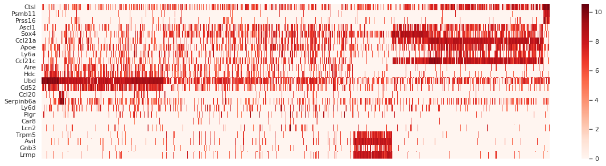
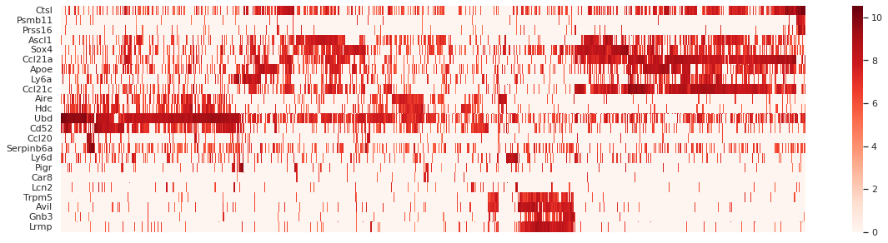
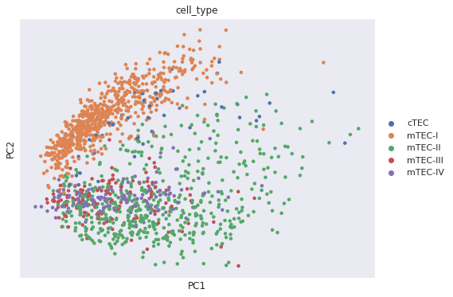
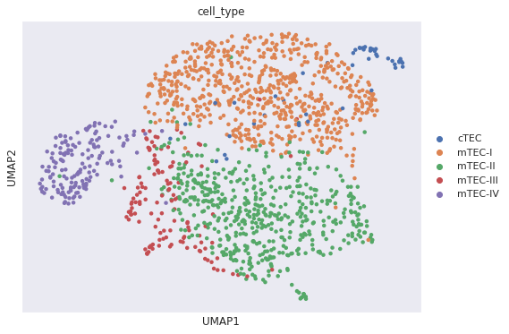

# [Jupyter Notebook](https://colab.research.google.com/drive/1Zg6itF0E7NUMsV7z7dWP9auPv6E05coT?usp=sharing)

### Описание метода нормализации данных
Различные уровни экспрессии генов могут объясняться не только дифференциальной экспрессией этих генов, но и более или менее сильной экспрессией генов в разных клетках. Чтобы учитывать это, нужно разделить значение экспрессии на суммарное число чтений образца и умножить на миллион (RPM). Для лучшей нормализации нужны данные о количестве ридов гена, его длине, но у нас таких данных нет.

### Heatmap для экспрессии маркерных генов
Образцы разделяются на 4-5 кластеров, было применено несколько методов для сравнения результатов, показаны два наиболее удачных

### Полученные визуализации UMAP и PCA
PCA | UMAP
-|-
Отделяет только mTEC-I от остальных 4 групп, но с разделением других групп не справляется | UMAP отделяет все 5 кластеров друг от друга довольно хорошо, выбросов мало
|
